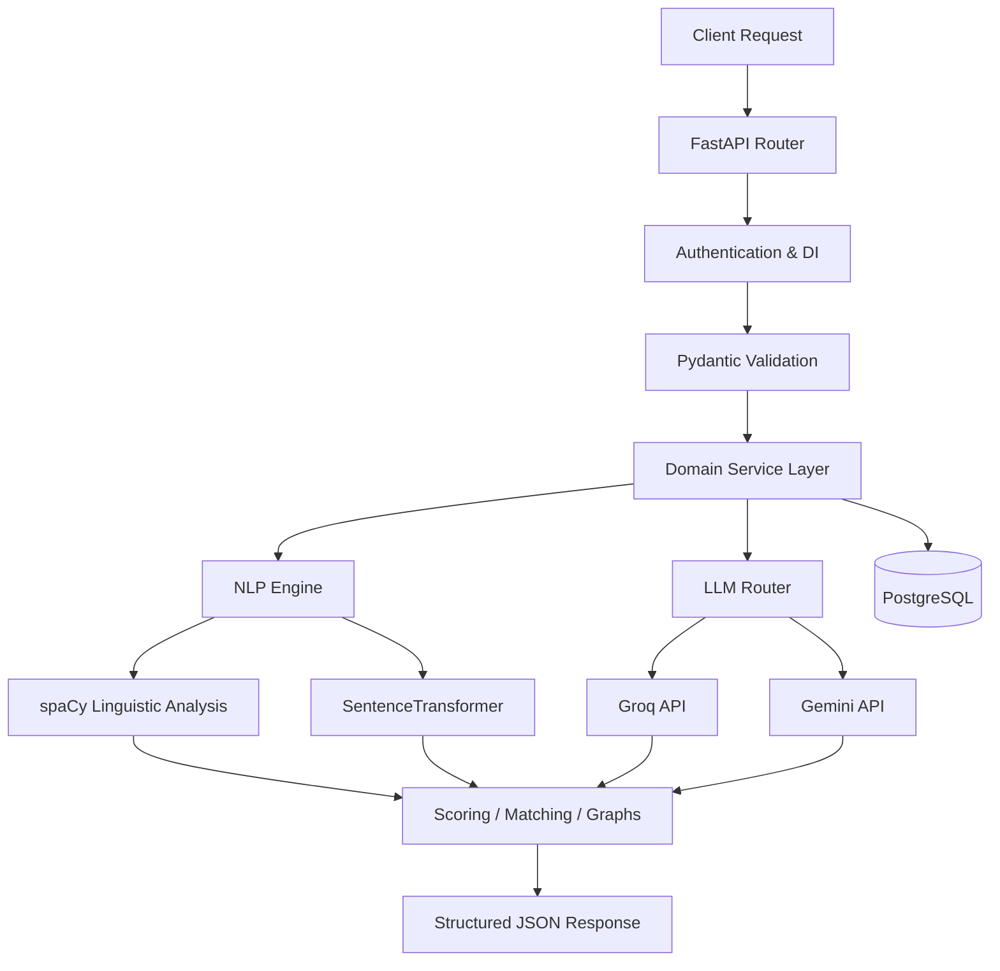
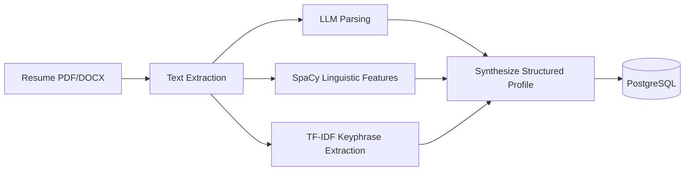
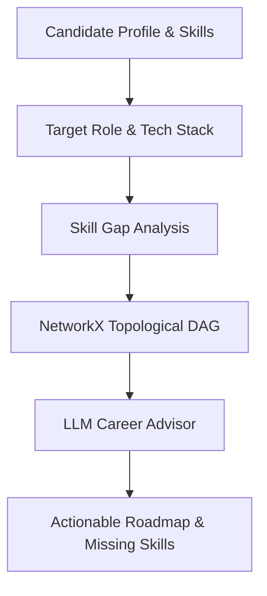
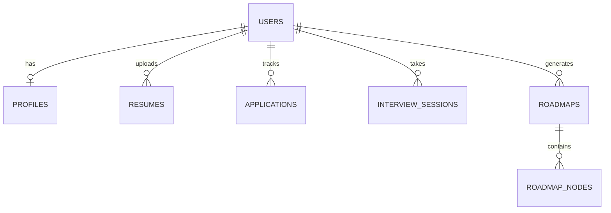

# ACE — Autonomous Career Intelligence Engine

ACE (Autonomous Career Intelligence Engine) is an advanced, AI-driven backend platform designed to provide highly personalized career guidance, resume analysis, and interview preparation. 

At its core, ACE solves the problem of generic career advice by applying real Natural Language Processing (NLP), dynamic semantic similarity matching, and topological dependency graphs to candidate profiles and target roles. It transforms unstructured career data (resumes, job descriptions) into structured, actionable intelligence without relying on static keyword lists.

What makes ACE technically distinct is its fully dynamic NLP pipeline combining PyTorch-based neural embeddings (`SentenceTransformers`) with linguistic analysis (`spaCy`) and LLM orchestration (Groq/Gemini). It builds a deterministic directed acyclic graph (DAG) of required skills to calculate precise learning roadmaps.

## Table of Contents
- [1. System Overview](#1-system-overview)
- [2. Backend Architecture](#2-backend-architecture)
- [3. End-to-End System Workflow](#3-end-to-end-system-workflow)
- [4. NLP & Intelligence Engine](#4-nlp--intelligence-engine)
- [5. Career Intelligence Pipeline](#5-career-intelligence-pipeline)
- [6. Job Matching & Recommendation Engine](#6-job-matching--recommendation-engine)
- [7. Database Architecture](#7-database-architecture)
- [8. API Architecture](#8-api-architecture)
- [9. External APIs & AI Services](#9-external-apis--ai-services)
- [10. API Performance & Latency](#10-api-performance--latency)
- [11. API Call Cost / Usage Characteristics](#11-api-call-cost--usage-characteristics)
- [12. Authentication & Security](#12-authentication--security)
- [13. Deployment Architecture](#13-deployment-architecture)
- [14. Docker & Container Architecture](#14-docker--container-architecture)
- [15. Scalability & Resource Design](#15-scalability--resource-design)
- [16. Reliability & Failure Handling](#16-reliability--failure-handling)
- [17. Testing](#17-testing)
- [18. Configuration & Environment Variables](#18-configuration--environment-variables)
- [19. Request Lifecycle Examples](#19-request-lifecycle-examples)
- [20. Engineering Decisions & Trade-offs](#20-engineering-decisions--trade-offs)
- [21. Known Limitations](#21-known-limitations)
- [22. Future Engineering Improvements](#22-future-engineering-improvements)
- [23. Technology Stack](#23-technology-stack)
- [24. Complete Architecture Diagram](#24-complete-architecture-diagram)

## 1. System Overview

ACE operates as a stateless intelligence backend that ingests candidate data, processes it through specialized NLP pipelines, and orchestrates requests across external LLMs to provide structured career insights.

```text
Client Request
       ↓
FastAPI Layer (Validation, Auth, Routing)
       ↓
Domain Services (Resume parsing, Interview execution, Job matching)
       ↓
NLP / AI Intelligence Layer (spaCy, SentenceTransformer, LLM Router)
       ↓
Database (PostgreSQL via asyncpg) & External APIs (Groq, Gemini)
       ↓
Structured Career Intelligence Response
```

## 2. Backend Architecture

The backend is built with **FastAPI** on **Python 3.11**, utilizing asynchronous execution for high-concurrency request handling.

- **Framework**: FastAPI
- **API Architecture**: REST-compliant modular routers (`app/api/*`).
- **Service Layer**: Business logic and orchestrations are isolated in `app/services/` (e.g., `nlp_service.py`, `career_intelligence.py`).
- **Schema/Validation Layer**: Strong Pydantic models in `app/schemas/` ensure strict I/O validation.
- **Database Layer**: SQLAlchemy 2.0 (Async) interacting with PostgreSQL. Models defined in `app/models/`.
- **Configuration**: Managed via `pydantic-settings` (`app/core/config.py`).
- **Authentication**: JWT Bearer tokens with bcrypt password hashing.
- **Dependency Injection**: Used extensively for DB sessions (`get_db`) and user context (`get_current_user`).
- **Asynchronous Execution**: Native `async`/`await` throughout. CPU-bound NLP tasks are offloaded via `asyncio.to_thread`.
- **Error Handling**: Global exception handler mapping unhandled exceptions to standardized HTTP 500 JSON responses.
- **Startup Lifecycle**: Implements a robust `lifespan` context manager with cold-start DB retries and automated schema migrations (table column checks).

### Module Architecture

```text
backend/
├── alembic/                 # Database migrations
├── app/
│   ├── api/                 # FastAPI routers (auth, resume, career, etc.)
│   ├── core/                # Config, DB engine, security, LLM router
│   ├── models/              # SQLAlchemy ORM definitions
│   ├── schemas/             # Pydantic validation models
│   └── services/            # Core business logic (NLP, ATS, Career Intel)
├── tests/                   # Pytest suite
├── Dockerfile               # Multi-stage container definition
└── requirements.txt         # Production dependencies
```

## 3. End-to-End System Workflow



### Resume → NLP → Skills Extraction


### Career Intelligence Generation


## 4. NLP & Intelligence Engine

The NLP pipeline is the most critical and robust component of ACE. It utilizes a fully dynamic stack with **ZERO hardcoded skill lists or static dictionaries**. 

### NLP Stack
- **Transformer Embeddings**: `sentence-transformers` using the `all-MiniLM-L6-v2` model running on PyTorch CPU inference.
- **Linguistic Processing**: `spaCy` using the `en_core_web_sm` model for dependency parsing and Named Entity Recognition (NER).
- **Statistical Extraction**: `scikit-learn` `TfidfVectorizer` for dynamic n-gram keyphrase extraction.
- **Graph Mathematics**: `networkx` for constructing Directed Acyclic Graphs (DAGs) representing skill dependencies.

### Operations

**Semantic Similarity (`compute_semantic_similarity`)**:
- **Input**: Candidate text, Target text.
- **Processing**: Embeds both strings into 384-dimensional dense vectors using `all-MiniLM-L6-v2`. Computes exact Cosine Similarity: `(u · v) / (||u|| * ||v||)`.
- **Fallback**: TF-IDF vector space cosine similarity if the transformer fails to load.
- **Output**: Match percentage and algorithm identifier.

**Linguistic Features (`extract_linguistic_features`)**:
- **Input**: Raw unstructured text (e.g., Resume).
- **Processing**: Passes text through the spaCy pipeline. Extracts `ents` (entities), `noun_chunks`, action verbs, and quantifiable impact metrics via regex.
- **Output**: Structured dictionaries of linguistic features.

**Dynamic Skill Gap Graph (`compute_dynamic_skill_graph_gap`)**:
- **Input**: Candidate skills, Target Job Description.
- **Processing**: Extracts TF-IDF keyphrases from the JD. Constructs a sequential `nx.DiGraph()`. Performs full-token set intersection to map candidate skills against required skills. Calculates Topological Sort and Shortest Paths to determine the optimal learning order.
- **Output**: Verified skills, missing skills, topological learning order, and prerequisite learning paths.

## 5. Career Intelligence Pipeline

ACE generates dynamic roadmaps by comparing validated candidate evidence against dynamic target role requirements.

1. **Input Normalization**: Resume text, verified skills, weak areas (from mock interviews), and target company requirements are gathered.
2. **Skill Alignment**: Uses Semantic Match and Token Intersection to find overlaps between the candidate and the target role stack.
3. **Graph Construction**: A Directed Acyclic Graph (DAG) is built dynamically. Cycles are identified and removed mathematically using `nx.simple_cycles`.
4. **LLM Synthesis**: The gap data is fed to the LLM Router (Groq/Gemini) with strict JSON schemas to generate prioritized gaps, actionable recommendations, and estimated effort.
5. **State Hashing**: A deterministic SHA-256 fingerprint is generated based on inputs to manage caching and detect when a force refresh is needed.
6. **Output**: Returns an enriched roadmap with computed `completed`, `blocked`, or `recommended` statuses based on the user's `LearningCompletions`.

## 6. Job Matching & Recommendation Engine

The engine avoids naive substring matching in favor of semantic token intersections and cosine similarity.

- **Embedding Generation**: Transforms JDs and resumes into 384-dimensional vectors.
- **Similarity Metrics**: Uses Cosine Similarity for global document matching (Resume vs JD).
- **Skill Overlap**: Uses dynamic full-token subset evaluation (`cand_tokens.issubset(target_tokens)`) to prevent false positives (e.g., "py" matching "python").
- **Roadmap Recommendations**: Missing skills are mathematically sorted via Topological Sort, ensuring candidates learn prerequisites before advanced topics.

## 7. Database Architecture

- **Engine**: PostgreSQL accessed via `asyncpg` driver.
- **ORM**: SQLAlchemy 2.0 (Async).
- **Pooling**: Configured with `pool_size=10`, `max_overflow=20`, `pool_recycle=300`, and `pool_pre_ping=True` to ensure resilient connections.
- **Migrations**: Alembic handles schema evolution. Startup routines execute safe column additions.

### Core Models

| Table | Purpose | Key Relationships / Fields |
|-------|---------|----------------------------|
| `users` | Core authentication. | `email`, `hashed_password`, `is_active` |
| `profiles` | Candidate metadata. | `target_role`, `skills_json` (JSON), `preferences` (JSON) |
| `resumes` | Stores parsed CVs. | `raw_text`, `parsed_data` (JSON), `ats_analysis` (JSON) |
| `applications`| Tracked job apps. | `role_title`, `status`, `jd_text`, `analysis` (JSON) |
| `interview_sessions`| Mock interviews. | `questions` (JSON), `transcript` (JSON), `feedback` (JSON) |
| `roadmaps` | Generated learning paths.| `target_role`, `version_hash` |
| `roadmap_nodes`| Individual roadmap steps. | `skill_name`, `prerequisites_json`, `impact` |



## 8. API Architecture

The API uses FastAPI routers mounted under `/api/v1`. 

### Key Endpoints (Representative)

| Method | Endpoint | Purpose | Auth | Request | Response |
|--------|----------|---------|------|---------|----------|
| POST | `/api/v1/auth/register` | Create account | No | `UserCreate` | `UserResponse` |
| POST | `/api/v1/auth/login` | Authenticate | No | `OAuth2PasswordRequestForm` | `Token` |
| GET | `/api/v1/auth/me` | Get current user | Yes | None | `UserResponse` |
| POST | `/api/v1/resume/upload` | Process/Parse Resume | Yes | `UploadFile` (multipart) | `ResumeSchema` |
| GET | `/api/v1/resume/latest` | Fetch last parsed CV | Yes | None | `ResumeSchema` |
| POST | `/api/v1/resume/ats-analysis` | Trigger ATS evaluation | Yes | `TriggerATSAnalysisRequest`| `ATSAnalysisResponse`|
| POST | `/api/v1/resume/compare-jd` | Semantic similarity check | Yes | `JDCompareRequest` | JSON Match Data |

*(Additional routers exist for `applications`, `career`, `jobs`, `interview`, `memory`, `analytics`, `company`, `agent`)*

## 9. External APIs & AI Services

ACE dynamically routes LLM requests to optimize speed and cost using the `llm_router`.

| Provider | Purpose | Endpoints / Models | Auth Mechanism |
|----------|---------|--------------------|----------------|
| **Groq** | Primary LLM Generation (Fastest) | `llama-3.3-70b-versatile` | API Key (Rotated 1-10 keys) |
| **Gemini** | Fallback LLM / Reasoning | `gemini-2.0-flash`, `gemini-1.5-flash` | API Key |
| **Adzuna** | External Job Data | Job search / salaries | App ID & Key |

*Note: Environment variables for keys include `GROQ_API_KEY` (and `GROQ_API_KEY_1` to `9`), `GEMINI_API_KEY`, `ADZUNA_APP_ID`, `ADZUNA_APP_KEY`. Real keys are never exposed.*

## 10. API Performance & Latency

*Note: Exact latencies are heavily dependent on external LLM provider speeds and hardware execution of NLP models. The following is derived from engineering architecture and configured timeouts.*

| Operation | Typical Cost Driver | Configured Timeout | Notes |
|-----------|---------------------|--------------------|-------|
| Resume Parsing | PDF Extraction + LLM Structuring + CPU NLP Inference | N/A | Offloaded to `asyncio.to_thread` for CPU bounds. |
| ATS Analysis | Complex LLM Reasoning | `LLM_EVALUATION_TIMEOUT` (45s)| Uses `llama-3.3-70b-versatile` or Gemini fallbacks. |
| NLP Embeddings | CPU Inference (`all-MiniLM-L6-v2`) | N/A | Models are cached globally in memory on startup. |
| General LLM Q&A | Simple LLM Call | `LLM_QUESTION_TIMEOUT` (30s) | Fast turnaround expected via Groq. |

## 11. API Call Cost / Usage Characteristics

- **LLM Routing**: `llm_router.py` attempts Groq first using a round-robin rotation of up to 10 keys to distribute rate limits. If Groq fails (e.g., 429), it falls back to Gemini 2.0 Flash, then Gemini 1.5 Flash.
- **ATS Analysis**: Makes heavy LLM calls. The system persists the result in `resumes.ats_analysis` (JSON) to prevent redundant costly LLM executions.
- **Career Intelligence**: Calculates a `version_hash` from Resume hash, target role, and verified skills. Caches the roadmap in the DB.

## 12. Authentication & Security

- **JWT Authentication**: Short-lived Access tokens (default 7 days).
- **Password Hashing**: Bcrypt (`passlib`).
- **Authorization**: Protected routes use `Depends(get_current_user)`.
- **Data Safety**: SQLAlchemy ORM mitigates SQL injection.
- **Secrets Management**: Handled via `.env` and `pydantic-settings`. Enforces `SECRET_KEY` modification in production.
- **File Upload Security**: Enforces file size limits (5 MB max), allowed extensions whitelist (`.pdf`, `.docx`, `.txt`), and sanitizes filenames (removes null bytes, extracts basename to prevent path traversal).

## 13. Deployment Architecture

**Target Deployment Architecture:**
- **Hosting**: Google Cloud Run / Render for backend.
- **Database**: Neon / Render PostgreSQL.
- **Containerization**: Stateless Docker container.
- **Autoscaling**: Designed for scale-to-zero.
- **Startup Efficiency**: The NLP models (`spaCy` en_core_web_sm, `SentenceTransformer` all-MiniLM-L6-v2) are downloaded during the Docker build process (`RUN python -m spacy...`), preventing massive multi-gigabyte downloads during container cold starts.

## 14. Docker & Container Architecture

The Dockerfile implements a multi-stage build:
1. **Builder Stage**: `python:3.11-slim` installs OS build dependencies and compiles Python requirements.
2. **Runner Stage**: Copies built dependencies. Pre-downloads ML models. Exposes `$PORT` (default 8000). Runs Alembic migrations `alembic upgrade head` sequentially before starting `uvicorn`.

```mermaid
flowchart TD
    Source[Source Code] --> Builder[Builder Image (Compile deps)]
    Builder --> Runner[Runner Image (Python 3.11)]
    Runner --> Cache[Pre-download NLP Models]
    Cache --> Init[Container Start]
    Init --> Alembic[Alembic Migrations]
    Alembic --> Uvicorn[Uvicorn Server]
```

## 15. Scalability & Resource Design

- **Stateless API**: Application state is stored in PostgreSQL, allowing horizontal scaling of the FastAPI container.
- **Database Pressure**: Managed by SQLAlchemy connection pool (`pool_size=10`, `max_overflow=20`). Maximum DB connections = `(10 + 20) * N_Instances`.
- **Memory Footprint**: High. Loading PyTorch, `SentenceTransformers`, and `spaCy` models requires substantial RAM. Concurrency per instance should be tuned based on available memory to prevent OOM kills.
- **CPU Bottlenecks**: Heavy NLP tasks are properly wrapped in `asyncio.to_thread` to prevent blocking the async event loop.

## 16. Reliability & Failure Handling

- **Database Pre-ping**: SQLAlchemy is configured with `pool_pre_ping=True` to recover gracefully from dropped connections.
- **Startup DB Check**: `main.py` runs a 3-attempt connection check with backoff before starting.
- **Migration Resilience**: Startup schema checks use `IF NOT EXISTS` and isolate transactions so one failed column addition doesn't crash the startup.
- **LLM Fallbacks**: `_execute_with_retry` implements exponential backoff. The router elegantly cascades from Groq -> Gemini 2.0 -> Gemini 1.5.
- **Degraded States**: If Career Intelligence LLM generation fails, the system automatically falls back to a deterministic, programmatic graph representation of missing skills without faking effort estimates.

## 17. Testing

The repository contains a robust Pytest suite (`backend/tests/`) consisting of 22 test files.
- **Coverage Areas**: ATS scoring (`test_ats_scoring.py`, `_arithmetic`, `_definitive`, `_hardening`), LLM Routing, Agent Orchestration, Analytics, Authentication, NLP pipeline, Resume parsing, Job matching, and Migration integrity.
- **Purpose**: Protects business logic integrity, validates dynamic graph topology, and ensures API contracts hold under various states.

## 18. Configuration & Environment Variables

| Variable | Required | Purpose | Example / Format |
|----------|----------|---------|------------------|
| `ENVIRONMENT` | No | Target environment | `production` |
| `SECRET_KEY` | Yes (in Prod) | JWT Signing Key | `<redacted>` |
| `DATABASE_URL` | Yes | Asyncpg DB Connection | `postgresql+asyncpg://...` |
| `GROQ_API_KEY` | Yes* | Primary LLM Provider | `<redacted>` |
| `GEMINI_API_KEY` | Yes* | Fallback LLM Provider | `<redacted>` |
| `BACKEND_CORS_ORIGINS`| No | Allowed Origins | `["https://app.com"]` |
| `ADZUNA_APP_ID` | No | Job Search API | `<redacted>` |

*(At least one LLM key is functionally required for features)*

## 19. Request Lifecycle Examples

### ATS Analysis Execution
```text
POST /api/v1/resume/ats-analysis
↓
Auth Middleware (JWT Validation)
↓
Fetch Latest Resume (PostgreSQL)
↓
Check Application DB for matching Job Description
↓
Execute ATS Analyzer (LLM Router -> Groq/Gemini)
↓
Process Response (Identify strengths, map evidence matrix)
↓
Update `resumes` table (`ats_analysis` JSON)
↓
Sync `profiles` table target role
↓
Return ATSAnalysisResponse (JSON)
```

## 20. Engineering Decisions & Trade-offs

- **Async SQLAlchemy vs Sync**: Chose `asyncpg` to maximize concurrent request throughput. *Trade-off*: Adds complexity to ORM relationships (`selectinload` required).
- **CPU NLP vs API Embeddings**: Chose local PyTorch CPU inference (`SentenceTransformer`) for embeddings. *Trade-off*: Increases container memory footprint and build time, but eliminates third-party API costs and latency for vectorization.
- **Dynamic Graphs vs Static Skill Trees**: Chose NetworkX DAGs derived from real-time text. *Trade-off*: Computationally heavier per-request, but prevents the system from giving outdated or hallucinatory skill prerequisites.

## 21. Known Limitations

- **LLM Dependency**: Core features (ATS, Career Synthesis, Resume Structuring) rely entirely on external LLM availability. If Groq and Gemini rate limits are hit simultaneously, features gracefully degrade or return 503s.
- **High Memory Base**: Python + PyTorch + spaCy requires significant container RAM, elevating minimum hosting costs.
- **Database Migrations on Startup**: Running `alembic upgrade head` in the Docker `CMD` can cause race conditions if multiple containers scale up simultaneously in Cloud Run.

## 22. Future Engineering Improvements

1. **Observability**: Implement OpenTelemetry or Datadog for precise latency tracing across the LLM and NLP bounds.
2. **Dedicated Worker Queue**: Move ATS Analysis and Resume Parsing to Celery/Redis background workers to decouple from HTTP timeouts.
3. **Migration Locking**: Extract Alembic migrations to a separate release phase (e.g., Cloud Run jobs) rather than container startup.
4. **Vector Database**: Migrate semantic matching from in-memory Cosine Similarity arrays to a dedicated vector store (e.g., pgvector) as candidate pools grow.

## 23. Technology Stack

| Layer | Technology | Purpose |
|------|------------|---------|
| **API Framework** | FastAPI (Python 3.11) | High-performance async REST APIs |
| **Database** | PostgreSQL | Relational persistence |
| **ORM / Driver** | SQLAlchemy 2.0 / `asyncpg` | Async database interaction |
| **NLP (Linguistics)**| spaCy (`en_core_web_sm`) | NER, Noun chunks, POS tagging |
| **NLP (Embeddings)**| SentenceTransformers | Vector representations (`all-MiniLM-L6-v2`) |
| **ML Runtime** | PyTorch / scikit-learn | TF-IDF and Tensor math |
| **Graph Logic** | NetworkX | Directed Acyclic Graphs for skill gaps |
| **Containerization**| Docker | Multi-stage build |

## 24. Complete Architecture Diagram

```mermaid
flowchart TD
    Client[Web/Mobile Client]
    
    subgraph ACE Backend Engine
        API[FastAPI Layer\nAuth, Validation, CORS]
        
        subgraph Domain Services
            Resume[Resume Parser]
            Career[Career Intelligence]
            ATS[ATS Analyzer]
            Int[Interview Engine]
        end
        
        subgraph Intelligence Core
            Spacy[spaCy NER / Syntax]
            Transformer[SentenceTransformer\nEmbeddings]
            Graph[NetworkX\nSkill DAGs]
            Router[LLM Router w/\nKey Rotation & Retry]
        end
        
        DB[(PostgreSQL\nvia asyncpg)]
    end
    
    subgraph External Providers
        Groq[Groq API\nllama-3.3-70b]
        Gem[Gemini API\nflash models]
        Adzuna[Adzuna\nJob Data]
    end

    Client <--> API
    API <--> Domain
    
    Resume & Career & ATS & Int <--> Intelligence Core
    
    Router <--> Groq
    Router <--> Gem
    
    Domain <--> DB
```
